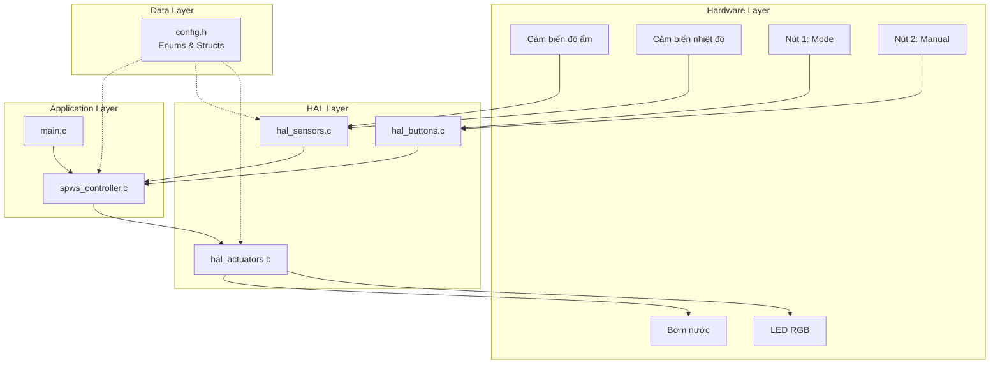

# 🌱 KẾ HOẠCH THỰC THI DỰ ÁN SPWS

> **Smart Plant Watering System - Hệ Thống Tưới Cây Tự Động Thông Minh**

---

## 📋 TỔNG QUAN DỰ ÁN

### Mục Đích
Thiết kế và lập trình một hệ thống nhúng quản lý việc tưới nước cho cây trồng với khả năng:
- Đọc dữ liệu cảm biến (độ ẩm đất, nhiệt độ)
- Tự động quyết định tưới nước dựa trên ngưỡng cấu hình
- Hỗ trợ chế độ thủ công
- Hiển thị trạng thái qua LED
- Thông báo trạng thái qua console

### Nền Tảng
- **Platform:** Embedded MCU (giả lập trên PC trong giai đoạn đầu)
- **Ngôn ngữ:** C
- **Compiler:** GCC
- **Mô hình:** Hardware Abstraction Layer (HAL)

### Timeline
- **Tổng thời gian:** 2 tuần
- **Sprint 1 (Tuần 1):** Requirements, Design, Core Implementation
- **Sprint 2 (Tuần 2):** Testing, Integration, Documentation

---

## 🎯 ÁP DỤNG QUY TRÌNH 7 BƯỚC THIẾT KẾ

### BƯỚC 1: Xác Định DỮ LIỆU Cần Quản Lý

#### Các Thực Thể (Entities):

**1️⃣ Dữ Liệu Cảm Biến (SensorData)**
- Độ ẩm đất (%)
- Nhiệt độ không khí (°C)

**2️⃣ Cài Đặt Hệ Thống (SystemSettings)**
- Ngưỡng độ ẩm tối thiểu (bắt đầu tưới)
- Ngưỡng độ ẩm tối đa (dừng tưới)
- Thời gian tưới tối đa (bảo vệ)
- Chu kỳ đọc cảm biến
- Thời gian tưới thủ công

**3️⃣ Trạng Thái Hệ Thống (SystemState)**
- Chế độ hoạt động (Auto/Manual)
- Trạng thái bơm (On/Off)
- Trạng thái LED (Normal/Watering/Alert/Error)
- Bộ đếm thời gian tưới

---

### BƯỚC 2: Thiết Kế DATA STRUCTURES (Structs & Enums)

```c
// ===== ENUMS =====

typedef enum {
    MODE_AUTO,
    MODE_MANUAL
} SystemMode_t;

typedef enum {
    PUMP_OFF,
    PUMP_ON
} PumpState_t;

typedef enum {
    LED_NORMAL,             // Xanh: Bình thường
    LED_WATERING,           // Vàng: Đang tưới
    LED_LOW_MOISTURE_ALERT, // Đỏ nhấp nháy: Cảnh báo
    LED_ERROR               // Đỏ sáng: Lỗi
} LedState_t;

// ===== STRUCTS =====

typedef struct {
    float soilMoisturePercent;
    float airTemperatureCelsius;
} SensorData_t;

typedef struct {
    float minMoistureThreshold;
    float maxMoistureThreshold;
    unsigned int maxWateringDuration_s;
    unsigned int sensorReadInterval_s;
    unsigned int manualWateringDuration_s;
} SystemSettings_t;

typedef struct {
    SystemMode_t currentMode;
    PumpState_t pumpState;
    LedState_t ledState;
    unsigned int wateringTimeCounter;
} SystemState_t;
```

---

### BƯỚC 3: Xác Định OPERATIONS (Thao Tác)

#### 📊 Sensor Operations
- `ReadSoilMoisture()` - Đọc độ ẩm đất
- `ReadAirTemperature()` - Đọc nhiệt độ
- `UpdateSensorData()` - Cập nhật dữ liệu cảm biến

#### ⚙️ Actuator Operations
- `TurnPumpOn()` - Bật bơm
- `TurnPumpOff()` - Tắt bơm
- `SetLED()` - Điều khiển LED
- `UpdateLEDState()` - Cập nhật trạng thái LED

#### 🎮 Button Operations
- `ReadButton1()` - Đọc nút chuyển chế độ
- `ReadButton2()` - Đọc nút tưới thủ công
- `HandleButton1Press()` - Xử lý nút 1
- `HandleButton2Press()` - Xử lý nút 2

#### 🧠 Controller Operations
- `SPWS_Init()` - Khởi tạo hệ thống
- `SPWS_RunAutoMode()` - Logic chế độ tự động
- `SPWS_RunManualMode()` - Logic chế độ thủ công
- `SPWS_CheckWateringCondition()` - Kiểm tra điều kiện tưới
- `SPWS_UpdateState()` - Cập nhật trạng thái

---

### BƯỚC 4: Thiết Kế FUNCTION SIGNATURES

```c
// ===== HAL Sensors =====
float HAL_ReadSoilMoisture(void);
float HAL_ReadAirTemperature(void);
void HAL_UpdateSensorData(SensorData_t *data);

// ===== HAL Actuators =====
void HAL_TurnPumpOn(void);
void HAL_TurnPumpOff(void);
void HAL_SetLED(LedState_t state);

// ===== HAL Buttons =====
bool HAL_IsButton1Pressed(void);
bool HAL_IsButton2Pressed(void);

// ===== SPWS Controller =====
void SPWS_Init(SystemState_t *state, SystemSettings_t *settings);
void SPWS_RunAutoMode(SystemState_t *state, 
                      SystemSettings_t *settings, 
                      SensorData_t *sensorData);
void SPWS_RunManualMode(SystemState_t *state, 
                        SystemSettings_t *settings);
void SPWS_HandleModeSwitch(SystemState_t *state);
void SPWS_HandleManualWatering(SystemState_t *state, 
                               SystemSettings_t *settings);
void SPWS_UpdateLED(SystemState_t *state);
void SPWS_PrintStatus(SystemState_t *state, SensorData_t *sensorData);
```

---

### BƯỚC 5: Phân Chia MODULES (Files)

```
src/
├── main.c                  # Vòng lặp chính, logic tổng thể
├── config.h                # Enums, structs, constants
├── spws_controller.c/.h    # Logic điều khiển chính
├── hal_sensors.c/.h        # Đọc cảm biến
├── hal_actuators.c/.h      # Điều khiển bơm & LED
└── hal_buttons.c/.h        # Xử lý nút nhấn
```

---

### BƯỚC 6: Thiết Kế PROJECT STRUCTURE

```
2_SMART_PLANT_WATERING_SYSTEM_SPWS/
│
├── docs/
│   ├── Variable And Datatypes.pdf    # Đề bài gốc
│   ├── REQUIREMENTS.md               # Tài liệu yêu cầu
│   ├── DESIGN.md                     # Tài liệu thiết kế
│   └── USER_GUIDE.md                 # Hướng dẫn sử dụng
│
├── include/
│   ├── config.h                      # Cấu hình, enums, structs
│   ├── spws_controller.h             # Controller header
│   ├── hal_sensors.h                 # Sensors HAL header
│   ├── hal_actuators.h               # Actuators HAL header
│   └── hal_buttons.h                 # Buttons HAL header
│
├── src/
│   ├── main.c                        # Entry point
│   ├── spws_controller.c             # Controller implementation
│   ├── hal_sensors.c                 # Sensors HAL implementation
│   ├── hal_actuators.c               # Actuators HAL implementation
│   └── hal_buttons.c                 # Buttons HAL implementation
│
├── tests/
│   ├── test_sensors.c                # Test cảm biến
│   ├── test_actuators.c              # Test actuators
│   └── test_controller.c             # Test controller logic
│
├── Makefile                          # Build system
├── README.md                         # Tổng quan dự án
└── .gitignore                        # Git ignore
```

---

### BƯỚC 7: Vẽ SYSTEM DIAGRAM



---

## 📅 TIMELINE CHI TIẾT - 2 TUẦN

### 🗓️ SPRINT 1 - TUẦN 1: Foundation & Core

#### Ngày 1-2: Requirements & Design
- [x] Đọc và phân tích đề bài
- [ ] Tạo tài liệu requirements chi tiết
- [ ] Thiết kế data structures
- [ ] Thiết kế system architecture
- [ ] Review design với mentor/team

#### Ngày 3-4: Project Setup & Config
- [ ] Tạo cấu trúc thư mục
- [ ] Tạo `config.h` với tất cả enums và structs
- [ ] Setup Makefile
- [ ] Setup Git repository
- [ ] Tạo README.md

#### Ngày 5-7: HAL Layer Implementation
- [ ] Implement `hal_sensors.c/.h`
  - Mock functions trả về giá trị giả lập
- [ ] Implement `hal_actuators.c/.h`
  - Print ra console thay vì điều khiển thật
- [ ] Implement `hal_buttons.c/.h`
  - Đọc từ keyboard thay vì nút vật lý
- [ ] Test từng module riêng lẻ

---

### 🗓️ SPRINT 2 - TUẦN 2: Logic & Testing

#### Ngày 8-10: Controller Logic
- [ ] Implement `spws_controller.c/.h`
  - `SPWS_Init()`
  - `SPWS_RunAutoMode()`
  - `SPWS_RunManualMode()`
  - Logic chuyển đổi trạng thái
- [ ] Implement `main.c`
  - Vòng lặp chính
  - Gọi các hàm controller

#### Ngày 11-12: Integration & Testing
- [ ] Integration testing
- [ ] Test các scenario:
  - Auto mode: độ ẩm thấp → bật bơm
  - Auto mode: độ ẩm cao → tắt bơm
  - Auto mode: timeout → tắt bơm
  - Manual mode: nhấn nút → tưới
  - Chuyển đổi mode
- [ ] Fix bugs

#### Ngày 13-14: Documentation & Delivery
- [ ] Viết USER_GUIDE.md
- [ ] Viết DEVELOPER_GUIDE.md
- [ ] Tạo walkthrough với screenshots
- [ ] Code review
- [ ] Final cleanup
- [ ] Commit & push to GitHub

---

## 🎯 PROPOSED CHANGES

### Core Module

#### [NEW] [config.h](file:///home/minhtri/Working_space/C_ADVANCED/2_SMART_PLANT_WATERING_SYSTEM_SPWS/include/config.h)
- Định nghĩa tất cả enums: `SystemMode_t`, `PumpState_t`, `LedState_t`
- Định nghĩa tất cả structs: `SensorData_t`, `SystemSettings_t`, `SystemState_t`
- Constants và macros

---

### HAL Layer

#### [NEW] [hal_sensors.h](file:///home/minhtri/Working_space/C_ADVANCED/2_SMART_PLANT_WATERING_SYSTEM_SPWS/include/hal_sensors.h)
- Function declarations cho sensor operations

#### [NEW] [hal_sensors.c](file:///home/minhtri/Working_space/C_ADVANCED/2_SMART_PLANT_WATERING_SYSTEM_SPWS/src/hal_sensors.c)
- Mock implementation: trả về giá trị random hoặc từ input
- Có thể mô phỏng độ ẩm tăng/giảm theo thời gian

#### [NEW] [hal_actuators.h](file:///home/minhtri/Working_space/C_ADVANCED/2_SMART_PLANT_WATERING_SYSTEM_SPWS/include/hal_actuators.h)
- Function declarations cho pump và LED

#### [NEW] [hal_actuators.c](file:///home/minhtri/Working_space/C_ADVANCED/2_SMART_PLANT_WATERING_SYSTEM_SPWS/src/hal_actuators.c)
- Mock implementation: print ra console
- Ví dụ: `printf("🚰 BƠM BẬT\n")`

#### [NEW] [hal_buttons.h](file:///home/minhtri/Working_space/C_ADVANCED/2_SMART_PLANT_WATERING_SYSTEM_SPWS/include/hal_buttons.h)
- Function declarations cho button operations

#### [NEW] [hal_buttons.c](file:///home/minhtri/Working_space/C_ADVANCED/2_SMART_PLANT_WATERING_SYSTEM_SPWS/src/hal_buttons.c)
- Mock implementation: đọc từ keyboard
- Ví dụ: nhấn 'm' = mode switch, 'w' = manual watering

---

### Application Layer

#### [NEW] [spws_controller.h](file:///home/minhtri/Working_space/C_ADVANCED/2_SMART_PLANT_WATERING_SYSTEM_SPWS/include/spws_controller.h)
- Function declarations cho controller logic

#### [NEW] [spws_controller.c](file:///home/minhtri/Working_space/C_ADVANCED/2_SMART_PLANT_WATERING_SYSTEM_SPWS/src/spws_controller.c)
- Core logic:
  - Auto mode: kiểm tra độ ẩm, quyết định bật/tắt bơm
  - Manual mode: xử lý nút nhấn
  - State management
  - LED updates

#### [NEW] [main.c](file:///home/minhtri/Working_space/C_ADVANCED/2_SMART_PLANT_WATERING_SYSTEM_SPWS/src/main.c)
- Entry point
- Khởi tạo hệ thống
- Vòng lặp chính:
  ```c
  while(1) {
      // Đọc nút nhấn
      // Đọc cảm biến (theo interval)
      // Chạy logic theo mode
      // Cập nhật LED
      // Print status
      // Delay
  }
  ```

---

### Build System

#### [NEW] [Makefile](file:///home/minhtri/Working_space/C_ADVANCED/2_SMART_PLANT_WATERING_SYSTEM_SPWS/Makefile)
- Compile tất cả .c files
- Link thành executable
- Targets: `all`, `clean`, `run`, `test`

---

### Documentation

#### [NEW] [README.md](file:///home/minhtri/Working_space/C_ADVANCED/2_SMART_PLANT_WATERING_SYSTEM_SPWS/README.md)
- Tổng quan dự án
- Hướng dẫn build và run
- Cấu trúc thư mục

#### [NEW] [docs/REQUIREMENTS.md](file:///home/minhtri/Working_space/C_ADVANCED/2_SMART_PLANT_WATERING_SYSTEM_SPWS/docs/REQUIREMENTS.md)
- Requirements chi tiết từ đề bài
- Use cases
- Functional & Non-functional requirements

#### [NEW] [docs/DESIGN.md](file:///home/minhtri/Working_space/C_ADVANCED/2_SMART_PLANT_WATERING_SYSTEM_SPWS/docs/DESIGN.md)
- Thiết kế chi tiết
- Diagrams
- Data structures
- State machine

---

## ✅ VERIFICATION PLAN

### Automated Tests

```bash
# Build project
make clean && make

# Run main application
./spws

# Run unit tests
make test
```

### Test Scenarios

#### Scenario 1: Auto Mode - Low Moisture
```
Initial: MODE_AUTO, độ ẩm = 25%
Expected: Bơm BẬT, LED = WATERING
```

#### Scenario 2: Auto Mode - High Moisture
```
Initial: MODE_AUTO, độ ẩm = 75%
Expected: Bơm TẮT, LED = NORMAL
```

#### Scenario 3: Auto Mode - Timeout
```
Initial: Bơm đang chạy 60s
Expected: Bơm TẮT (timeout protection)
```

#### Scenario 4: Manual Mode
```
Action: Nhấn nút 2
Expected: Bơm BẬT 10s rồi tự TẮT
```

#### Scenario 5: Mode Switch
```
Action: Nhấn nút 1
Expected: Chuyển AUTO ↔ MANUAL, bơm TẮT nếu đang chạy
```

### Manual Verification
- Quan sát console output
- Kiểm tra state transitions
- Kiểm tra LED updates
- Kiểm tra timing

---

## 📚 BEST PRACTICES ÁP DỤNG

### Code Quality
- ✅ Naming convention rõ ràng
- ✅ Comments cho logic phức tạp
- ✅ Error handling đầy đủ
- ✅ Const correctness
- ✅ No magic numbers

### Architecture
- ✅ Separation of concerns (HAL vs Application)
- ✅ Single Responsibility Principle
- ✅ Easy to test
- ✅ Easy to port to real hardware

### Git Workflow
- ✅ Commit messages có ý nghĩa
- ✅ Commit nhỏ, thường xuyên
- ✅ Branch cho từng feature
- ✅ .gitignore cho build artifacts

---

## 🎓 HỌC ĐƯỢC GÌ TỪ DỰ ÁN NÀY?

### Kỹ Năng Kỹ Thuật
- ✅ Thiết kế data structures (enums, structs)
- ✅ State machine design
- ✅ Hardware Abstraction Layer pattern
- ✅ Modular programming
- ✅ Makefile và build system

### Kỹ Năng Quy Trình
- ✅ Requirements analysis
- ✅ System design (7 bước)
- ✅ Implementation planning
- ✅ Testing strategy
- ✅ Documentation

### Kỹ Năng Embedded
- ✅ Sensor reading
- ✅ Actuator control
- ✅ Button handling
- ✅ State management
- ✅ Timing và intervals

---

## 🚀 NEXT STEPS

Sau khi hoàn thành kế hoạch này, bạn có thể:

1. **Bắt đầu triển khai** theo từng bước
2. **Review kế hoạch** với mentor/giảng viên
3. **Điều chỉnh** nếu cần thiết
4. **Bắt tay vào code!** 💪

---

**Prepared by:** Antigravity AI Assistant  
**Date:** 2026-02-01  
**Project:** Smart Plant Watering System (SPWS)
